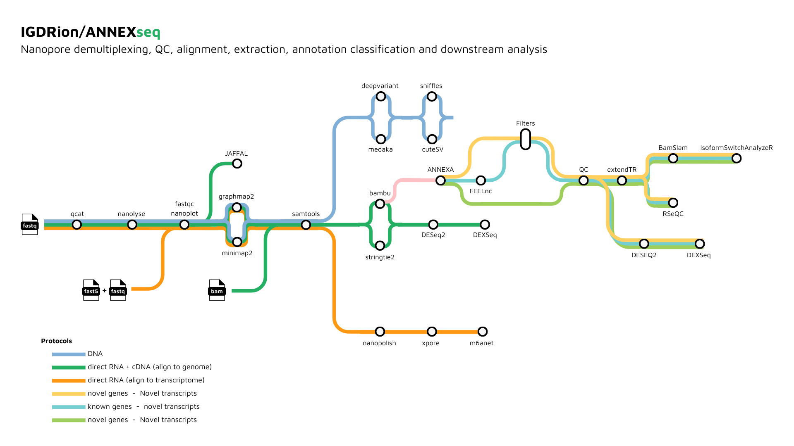

---
⚠️ Code has been moved to
[IGDRIon/ANNEXseq](https://github.com/IGDRIon/ANNEXseq.git) ⚠️
---

## Introduction
ANNEXAseq is a bioinformatics analysis pipeline for LR-RNAseq data (Long-Read RNASeq). It works by performing basecalling, demultiplexing, QC, alignment on Nanopore RNA data using the *nf-core/nanoseq* pipeline, and then reconstructs and quantifies both known, novel genes and isoforms using the *ANNEXA* pipeline.

## Pipeline Summary
### **Nanoseq**
The nanoseq pipeline takes raw Nanopore sequencing data as input and performs various optional pre-processing steps including demultiplexing and cleaning, followed by quality control checks and alignment using either GraphMap2 or minimap2 aligners.

 Mapping metrics are obtained and bigWig and bigBed coverage tracks are created for visualization. For DNA samples, short and structural variant calling is performed using medaka, deepvariant, pepper_margin_deepvariant, sniffles or cutesv. 
 
 For RNA samples, transcript reconstruction and quantification is performed using either bambu or StringTie2, followed by differential expression analysis using DESeq2 and/or DEXSeq.
 
 Additional analyses including RNA modification detection and RNA fusion detection are performed using xpore, m6anet and JAFFAL.
 
 MultiQC is used to present QC for raw read and alignment results.
### **Annexa**
ANNEXA pipeline takes a reference genome, a reference annotation, and mapping files as inputs, and it provides an extended annotation that distinguishes between novel protein-coding (mRNA) and long non-coding RNAs (lncRNA) genes.

   The pipeline performs transcriptome reconstruction and quantification, novel classification, and filtering based on multiple features.

   The output is a final gtf file with a 3-level structure (gene, transcript, exon), and graphical outputs containing information about known and novel gene/transcript models such as length, number of spliced transcripts, and normalized expression levels. 
   
   The pipeline also performs quality control and an optional gene body coverage check.

## Pipeline Outline
1. ### Nanoseq
   1. Demultiplexing ([`qcat`](https://github.com/nanoporetech/qcat); _optional_)
   2. Raw read cleaning ([NanoLyse](https://github.com/wdecoster/nanolyse); _optional_)
   3. Raw read QC ([`NanoPlot`](https://github.com/wdecoster/NanoPlot), [`FastQC`](http://www.bioinformatics.babraham.ac.uk/projects/fastqc/))
   4. Alignment ([`GraphMap2`](https://github.com/lbcb-sci/graphmap2) or [`minimap2`](https://github.com/lh3/minimap2))
      - Both aligners are capable of performing unspliced and spliced alignment. Sensible defaults will be applied automatically based on a combination of the input data and user-specified parameters
      - Each sample can be mapped to its own reference genome if multiplexed in this way
      - Convert SAM to co-ordinate sorted BAM and obtain mapping metrics ([`samtools`](http://www.htslib.org/doc/samtools.html))
   5. Create bigWig ([`BEDTools`](https://github.com/arq5x/bedtools2/), [`bedGraphToBigWig`](http://hgdownload.soe.ucsc.edu/admin/exe/)) and bigBed ([`BEDTools`](https://github.com/arq5x/bedtools2/), [`bedToBigBed`](http://hgdownload.soe.ucsc.edu/admin/exe/)) coverage tracks for visualisation
   6. DNA specific downstream analysis:
      - Short variant calling ([`medaka`](https://github.com/nanoporetech/medaka), [`deepvariant`](https://github.com/google/deepvariant), or [`pepper_margin_deepvariant`](https://github.com/kishwarshafin/pepper))
      - Structural variant calling ([`sniffles`](https://github.com/fritzsedlazeck/Sniffles) or [`cutesv`](https://github.com/tjiangHIT/cuteSV))
   7. RNA specific downstream analysis:
      - Transcript reconstruction and quantification ([`bambu`](https://bioconductor.org/packages/release/bioc/html/bambu.html) or [`StringTie2`](https://ccb.jhu.edu/software/stringtie/))
      - bambu performs both transcript reconstruction and quantification
      - When StringTie2 is chosen, each sample can be processed individually and combined. After which, [`featureCounts`](http://bioinf.wehi.edu.au/featureCounts/) will be used for both gene and transcript quantification.
      - Differential expression analysis ([`DESeq2`](https://bioconductor.org/packages/release/bioc/html/DESeq2.html) and/or [`DEXSeq`](https://bioconductor.org/packages/release/bioc/html/DEXSeq.html))
      - RNA modification detection ([`xpore`](https://github.com/GoekeLab/xpore) and/or [`m6anet`](https://github.com/GoekeLab/m6anet))
      - RNA fusion detection ([`JAFFAL`](https://github.com/Oshlack/JAFFA))
   8. Present QC for raw read and alignment results ([`MultiQC`](https://multiqc.info/docs/))
2. ### **Annexa**
   1. Check if the input annotation contains all the information needed.
   2. Transcriptome reconstruction and quantification with [`bambu`](https://bioconductor.org/packages/release/bioc/html/bambu.html).
   3. Novel classification with [`FEELnc`](https://github.com/tderrien/FEELnc).
   4. Retrieve information from input annotation and format final gtf with 3 structure levels: 
      + gene
      + transcript
      + exon.
   5. Filter novel transcripts based on [`bambu`](https://bioconductor.org/packages/release/bioc/html/bambu.html) and/or [`TransformKmers`](https://github.com/IGDRion/ANNEXA/tree/main/modules/transforkmers) Novel Discovery Rates.
   6. Perform a quality control (see [`qc`](https://github.com/enoracrl/ANNEXA/tree/main/modules/qc)) of both the full and filtered extended annotations (see example).
   7. *Optional*: Check gene body coverage with [`RSeQC`](https://github.com/enoracrl/ANNEXA/tree/main/modules/rseqc).

## Functionality Overview

A graphical overview of suggested routes through the pipeline depending on the desired output can be seen below.

<p align="center">
    

## Quick Start

1. Install [`Nextflow`](https://www.nextflow.io/docs/latest/getstarted.html#installation) (`>=22.10.1`)

2. Install any of [`Docker`](https://docs.docker.com/engine/installation/), [`Singularity`](https://www.sylabs.io/guides/3.0/user-guide/) (you can follow [this tutorial](https://singularity-tutorial.github.io/01-installation/)), [`Podman`](https://podman.io/), [`Shifter`](https://nersc.gitlab.io/development/shifter/how-to-use/) or [`Charliecloud`](https://hpc.github.io/charliecloud/) for full pipeline reproducibility _(you can use [`Conda`](https://conda.io/miniconda.html) both to install Nextflow itself and also to manage software within pipelines. Please only use it within pipelines as a last resort; see [docs](https://nf-co.re/usage/configuration#basic-configuration-profiles))_.

3. Test the pipelines on a minimal dataset with a couple commands:
      ```console
      nextflow run nf-core/nanoseq -profile test,YOURPROFILE
      ```

      ```console
      nextflow run IGDRion/ANNEXA -profile test,conda
      ```

   Note that some form of configuration will be needed so that Nextflow knows how to fetch the required software. This is usually done in the form of a config profile (`YOURPROFILE` in the example command above). You can chain multiple config profiles in a comma-separated string.

   > - The pipeline comes with config profiles called `docker`, `singularity`, `podman`, `shifter`, `charliecloud` and `conda` which instruct the pipeline to use the named tool for software management. For example, `-profile test,docker`.
   > - Please check [nf-core/configs](https://github.com/nf-core/configs#documentation) to see if a custom config file to run nf-core pipelines already exists for your Institute. If so, you can simply use `-profile <institute>` in your command. This will enable either `docker` or `singularity` and set the appropriate execution settings for your local compute environment.
   > - If you are using `singularity` and are persistently observing issues downloading Singularity images directly due to timeout or network issues, then you can use the `--singularity_pull_docker_container` parameter to pull and convert the Docker image instead. Alternatively, you can use the [`nf-core download`](https://nf-co.re/tools/#downloading-pipelines-for-offline-use) command to download images first, before running the pipeline. Setting the [`NXF_SINGULARITY_CACHEDIR` or `singularity.cacheDir`](https://www.nextflow.io/docs/latest/singularity.html?#singularity-docker-hub) Nextflow options enables you to store and re-use the images from a central location for future pipeline runs.
   > - If you are using `conda`, it is highly recommended to use the [`NXF_CONDA_CACHEDIR` or `conda.cacheDir`](https://www.nextflow.io/docs/latest/conda.html) settings to store the environments in a central location for future pipeline runs.

4. Start running your own analysis!


## Documentation
### **Nanoseq**
The nf-core/nanoseq pipeline comes with documentation about the pipeline [usage](https://nf-co.re/nanoseq/usage), [parameters](https://nf-co.re/nanoseq/parameters) and [output](https://nf-co.re/nanoseq/output).

```bash
nextflow run nf-core/nanoseq \
    --input samplesheet.csv \
    --protocol DNA \
    --barcode_kit SQK-PBK004 \
    -profile <docker/singularity/podman/institute>
```

See [usage docs](https://nf-co.re/nanoseq/usage) for all of the available options when running the pipeline.

An example input samplesheet for performing both basecalling and demultiplexing can be found [here](assets/samplesheet.csv).

### **Annexa**

Run ANNEXA on your own data (change input, gtf, fa with path of your files).

```sh
nextflow run IGDRion/ANNEXA \
    -profile {test,docker,singularity,conda,slurm} \
    --input samples.txt \
    --gtf /path/to/ref.gtf \
    --fa /path/to/ref.fa
```

The input parameter takes a file listing the `bam` path files to analyze (see example below)

```
/path/to/1.bam
/path/to/2.bam
/path/to/3.bam
```

### Options

```
Required:
--input             : Path to file listing paths to bam files.
--fa                : Path to reference genome.
--gtf               : Path to reference annotation.


Optional:
-profile test       : Run annexa on toy dataset.
-profile slurm      : Run annexa on slurm executor.
-profile singularity: Run annexa in singularity container.
-profile conda      : Run annexa in conda environment.
-profile docker     : Run annexa in docker container.

--filter            : Perform or not the filtering step. false by default.
--tfkmers_tokenizer : Path to TransforKmers tokenizer. Required if filter activated.
--tfkmers_model     : Path to TransforKmers model. Required if filter activated.
--bambu_threshold   : bambu NDR threshold below which new transcripts are retained.
--tfkmers_threshold : TransforKmers NDR threshold below which new transcripts are retained.
--operation         : Operation to retained novel transcripts. "union" retain tx validated by either bambu or transforkmers, "intersection" retain tx validated by both.

--withGeneCoverage  : Run RSeQC (can be long depending on annotation and bam sizes). False by default.

--maxCpu            : max cpu threads used by ANNEXA. 8 by default.
--maxMemory         : max memory used by ANNEXA. 40GB by default.
```

> If the filter argument is set to `true`, TransforKmers model and tokenizer paths have to be given. They can be either downloaded from the [TransforKmers official repository](https://github.com/mlorthiois/TransforKmers) or trained in advance by yourself on your own data.

### Filtering step

By activating the filtering step (`--filter`), ANNEXA proposes to filter the generated extended annotation according to 2 methods:

1. By using the NDR proposed by [bambu](https://github.com/GoekeLab/bambu). This threshold includes several information such as sequence profile, structure (mono-exonic, etc) and quantification (number of samples, expression). Each transcript with an NDR below the classification threshold will be retained by ANNEXA.

2. By analysing the TSS of each new transcript using the [TransforKmers](https://github.com/mlorthiois/TransforKmers) (deep-learning) tool. Each TSS validated below a certain threshold will be retained. We already provide 2 trained models for filtering TSS with TransforKmers.

- A [human specific
  model](https://genostack-api-swift.genouest.org/v1/AUTH_07c8a078861e436ba41c4416a821e5d0/transforkmers/hsa_5prime_bert_6-512.zip?temp_url_sig=59e4bd439f42fc2bb8953e78eae82306466917d2&temp_url_expires=2661501621)
- A [dog specific model](https://genostack-api-swift.genouest.org/v1/AUTH_07c8a078861e436ba41c4416a821e5d0/transforkmers/dog_5prime_bert_6-512.zip?temp_url_sig=a5378b6f2cc9ffc10b8f5d4fa6e535070d22f845&temp_url_expires=2661844043)

To use them, extract the zip, and point `--tfkmers_model` and `--tfkmers_tokenizer` to the subdirectories.

The filtered annotation can be the `union` of these 2 tools, _i.e._ all the transcripts validated by one or both of these tools; or the `intersection`, _i.e._ the transcripts validated by both tools.

At the end, the QC steps are performed both on the full and filtered extended annotations.
## Testing
The nanoseq pipeline is tested through automated continuous integration. See the [nf-core/nanoseq](https://github.com/nf-core/nanoseq) repository.

The ANNEXA pipeline has been tested with reference annotation from Ensembl and NCBI-RefSeq.
## Credits
ANNEXseq is written by [@enoracrl](https://github.com/enoracrl), [@vlebars](https://github.com/vlebars), [@atoffano](https://github.com/Aurore-B), [@Aurore-B](https://github.com/Aurore-B), [@tderrien](https://github.com/tderrien) from the [Institue of Genetics and Development of Rennes](https://igdr.univ-rennes.fr/en).

nf-core/nanoseq was originally written by [Chelsea Sawyer](https://github.com/csawye01) and [Harshil Patel](https://github.com/drpatelh) from [The Bioinformatics & Biostatistics Group](https://www.crick.ac.uk/research/science-technology-platforms/bioinformatics-and-biostatistics/) for use at [The Francis Crick Institute](https://www.crick.ac.uk/), London. Other primary contributors include [Laura Wratten](https://github.com/lwratten), [Ying Chen](https://github.com/cying111), [Yuk Kei Wan](https://github.com/yuukiiwa) and [Jonathan Goeke](https://github.com/jonathangoeke) from the [Genome Institute of Singapore](https://www.a-star.edu.sg/gis), [Christopher Hakkaart](https://github.com/christopher-hakkaart) from [Institute of Medical Genetics and Applied Genomics](https://www.medizin.uni-tuebingen.de/de/das-klinikum/einrichtungen/institute/medizinische-genetik-und-angewandte-genomik), Germany, and [Johannes Alneberg](https://github.com/alneberg) and [Franziska Bonath](https://github.com/FranBonath) from [SciLifeLab](https://www.scilifelab.se/), Sweden.
Many thanks to others who have helped out along the way too, including (but not limited to): [@crickbabs](https://github.com/crickbabs), [@AnnaSyme](https://github.com/AnnaSyme), [@ekushele](https://github.com/ekushele).

ANNEXA was originally written by [@mlorthiois](https://github.com/mlorthiois), [@tderrien](https://github.com/tderrien), [@Aurore-B](https://github.com/Aurore-B) from the [Institue of Genetics and Development of Rennes](https://igdr.univ-rennes.fr/en).

## Citations

An extensive list of references for the tools used by the  nanoseq pipeline can be found in the [`CITATIONS.md`](CITATIONS.md) file.

You can cite the `nf-core` publication as follows:

> **The nf-core framework for community-curated bioinformatics pipelines.**
>
> Philip Ewels, Alexander Peltzer, Sven Fillinger, Harshil Patel, Johannes Alneberg, Andreas Wilm, Maxime Ulysse Garcia, Paolo Di Tommaso & Sven Nahnsen.
>
> _Nat Biotechnol._ 2020 Feb 13. doi: [10.1038/s41587-020-0439-x](https://dx.doi.org/10.1038/s41587-020-0439-x).
